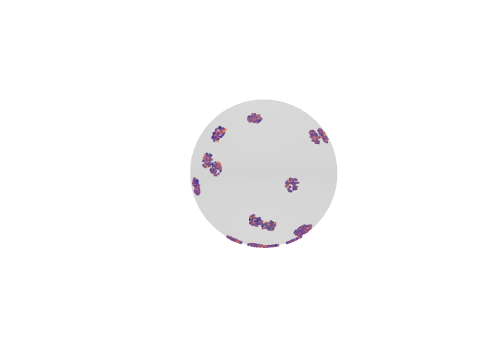
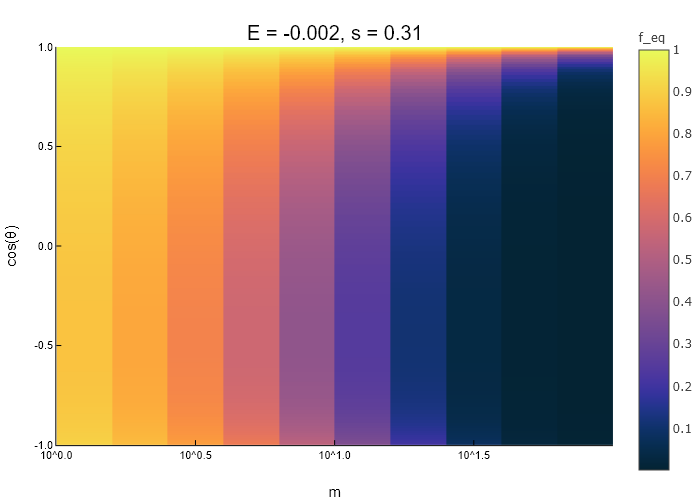

# VRROOMe

Vector Resonant Relaxation Out Of Maximum entropy

## Installation

You'll need to install Julia, by following the instructions at ` https://julialang.org/downloads/platform/ `\
To invoke Julia in the terminal, you'll need to make sure that the Julia command-line program is in your ` PATH `

You'll also need to install the following Julia packages:
- Distributions
- Plots
- PlotlyJS
- Interpolations
- HDF5
- StaticArrays
- FastGaussQuadrature
- Random
- LinearAlgebra

**WARNING: Do NOT interupt the installation of the packages!**

Once all of this is done, you can test if everything is ready by running the file ` Code/Example.jl ` in the REPL.\
After a few minutes, it should produce:

> ` WARNING: using Distributions.scale in module Main conflicts with an existing identifier. `\
> ` WARNING: redefinition of constant TAB_INT_SL. This may fail, cause incorrect answers, or produce other errors. `\
> ` true `

Don't worry about the warnings.\
It should also display 2 plots, which should be perfect replicas of ` Figures/Initial_cluster.png ` and ` Figures/Relaxed_cluster.png `:

` Figures/Initial_cluster.png ` | ` Figures/Relaxed_cluster.png `
- | -
 | 

If you prefer to run Julia from the terminal rather than the REPL, you might get 2 blank windows instead of 2 plots.\
This is a registered bug in PlotlyJS v0.14.1, you have to upgrade to version v0.18.8 or higher:

> ` Pkg.update("PlotlyJS") `

Please note that from terminal, the plots might take some time to appear, even after the window pops up.

## First steps

The ` Code/Example.jl ` has been designed to provide examples of the commands I find the most usefull.\
Please read through it to get started.

## Advanced usage

The more advanced reader might feel the need to play with lower-level functions. Please do so, they are all in the ` Code/ ` folder.\
I tried to document these within the code itself. But should my comments be unsufficient, please send me an e-mail at ` nathan.magnan@maths.cam.ac.uk ` to request clarifications.

## Usage in research

If you've use VROOMe for research, please cite the paper **To Be Completed once it is published**.
